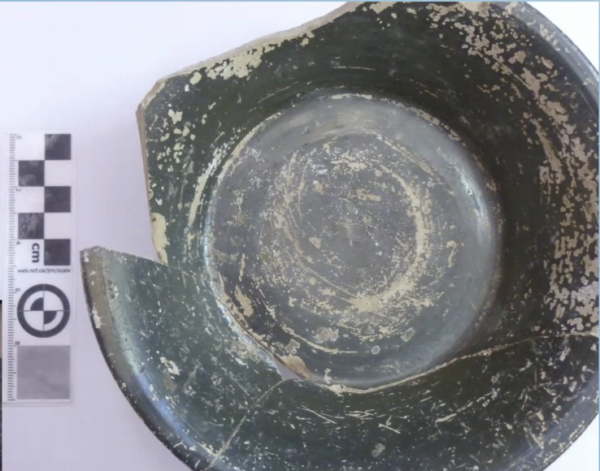

# Jeremy Presentation
- Computing under duress, no funding, lack of resources
### Personal Interest

- Simplicity is the final achievement, the crowning reward of art - Chopin
- Coming from English/film BG
- It's embedded in Jeremy's work, how he grew up, hand-me-downs
- Minimal computing enhances accessibility while requiring human participation to "fill in gaps"
- **Minimal computing approaches and processes force a paradigm of accessibility, efficiency, and simplicity, forcing a more humanistic approach**
### What is it?

- ***The computational process designed and forced under a minimalist approach***
- Drawing from minimalist art and philosophy
	- Minimalists approaches are…
	- Simple
	- Accessible to viewers
	- Down to earth
	- Metacritical
- ***Minimal computing is the philosophy applied to computational processes emphasizing simplicity and intentionality***
- In order to follow this movement, minimal computing is inherently *more accessible and sustainable than modern computing techniques and technologies* (faster processing, in-depth algorithms)
	- It is inherently tied to social justice and class issues, criticizing the idea that more expensive tech is inherently better
- ***Minimal computing is inherently human and relates to aesthetics of power, it aims to break down barriers that hinder communication and collaboration among researchers***

### Minimal Computing in Practice
- Minimal computing reduces the need for substantial storage and processing power, and also reliance on other platforms
- **Sustainability is the key to minimal computing, minimizing jargon can make computing more accessible and inclusive. Further discussion and adoption increases the scope of minimal computing**
- It often arises in settings where accessibility and resilience is paramount, ***making a shift towards thoughtful and intentional uses of technology***
- Minimal computing fosters a deeper understanding of digital systems, **bringing about a deeper digital literacy**
- "learning which button to press in wordpress is not the same as understanding the structure of the blog"
- minimizes security issues and the need for ongoing maintenance
- **Further Thoughts**
	- looking at minimal computing practice of the disc operating systems, use an interactive text line interface
		- type in commands to your computer directly
			- rather than selecting options from menus, you are your mouse like modern Windows systems do
		- lack of graphical user interfaces provides a minimalist approach to computing
	- ***Less operating liberties and the human is at the core of every process, DOS also shows the computer's thought, demystifying it***
### Conclusion and Discussion
- ***Minimal computing is about the process, not the design***
- it forces users to consider why and how they use technology, by stripping excess, making more intentional, ethical, tool selection
- helps humanities remain humble and accessible

##### Discussion Questions
1. How does minimal computing intersect with issues of digital sustainability and environmental impact?
	1. deepseek ironically is an example of minimal computing, they were able to create something with constraints and limitations in their technology
2. what are some fields outside of academia where minimal computing could be useful?
3. how might minimal computing approaches change if internet access is more restricted in the future?
4. how do the constraints of minimal computing encourage creativity in writing, coding, a design?
5. can limitations on technology lead to more innovative solutions? why or why not?
6. in an increasingly digital world, what does it mean to be "minimal"? Can minimal computing ever truly exist in high-tech societies?
	1. punk movements as a time of the past
	2. [solarpunk](https://en.wikipedia.org/wiki/Solarpunk)
		1. "We covered some solarpunk media briefly in a writing workshop focused on writing during climate crisis, really interesting to see stories dominated by the notion of sustainability as an act of resistance by refusing to engage with consumerist norms" --SEAN online

## [ DH 5000 24/25 Manifesto](https://docs.google.com/document/d/1jHQ2xaaBS2CI_TM1lLuHJ3DLT10xKsami-XAC92ALLU/edit?usp=sharing)
- extra discussion- [The Dark Souls of Archaeology: Recording Elden Ring](https://dl.acm.org/doi/10.1145/3555858.3555889)
- shared concern about the broader world and what we are living in 
	- this has been a recent shift, concerns are growing compared to previous cohorts
- thoughts for MRE: ensuring replicability and preservation long term
	- using seeds

# Laura Banducci Pres. - Going Digital in Italian Archaeology 
- hyper-critical of overly digitizing archaeology
- worked on the site of Gabii for 18 years
- used coordinates to make a GIS map of the site, also 3D modelling through photogrammetry 
	- this allows for continuous analysis and public-facing models
	- archaeology destroys through the work process, this is still happening physically, but it allows for preservation and change
- site/book has unity 3D model, three levels of knowledge (layman, historian, archaeologist)
- negotiating open access between publishers and researchers
- research examines questions of what happens to cities near Rome when Rome becomes "happening"? (occurring from the 3rd to 1st century BCE)
- in the late 1st century BCE to 2nd century CE, bedrock is quarried and burials begin, signifying that Gabii is no longer a city
	- tombs use reused roof tiles, signifying lower-income status
	- head resting on the house wall shows that people knew the house was there, they would be burying in city limits if it was still a city
- there were however still signs of living during this time, did the city limits recede as the city died out?
- got military grade Toughpads to record field notes digitally, GIS compatibility allows for easy access to the GIS map on the field
- data is accessible, but not google-able to prevent bot access and protect intellectual property and heritage
- new database is on ESRI
- Also does Digital Recording of Roman pottery, mostly funerary uses, initially uncovered under Mussolini but packed away until they went to the University of Missouri
	- performing use wear analysis to examine how objects were used in every day contexts (e.g. marks indicating a cup was used to stir liquid)
 
 
 
- spoon use wear indicated that many people were right-handed
- DH applications, 3D laser scanning object at 4 resolutions
- using digital landscape archaeology methods for use wear, examining cuts, indentations, etc. on a micro-scale 

Question: 
- potential for previously destroyed sites? Schliemann in Troy and Mycenae 
	- speculative works, VR interpretations of the site to explore potential findings
	- using linguistic data from Schiemann to reconstruct 
- preserving decaying sites like Knossos in Crete
	- more fruitful for this, often done
